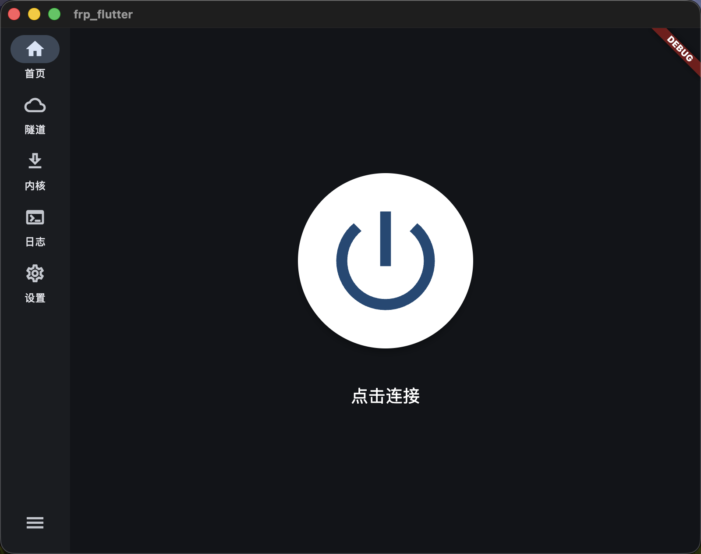
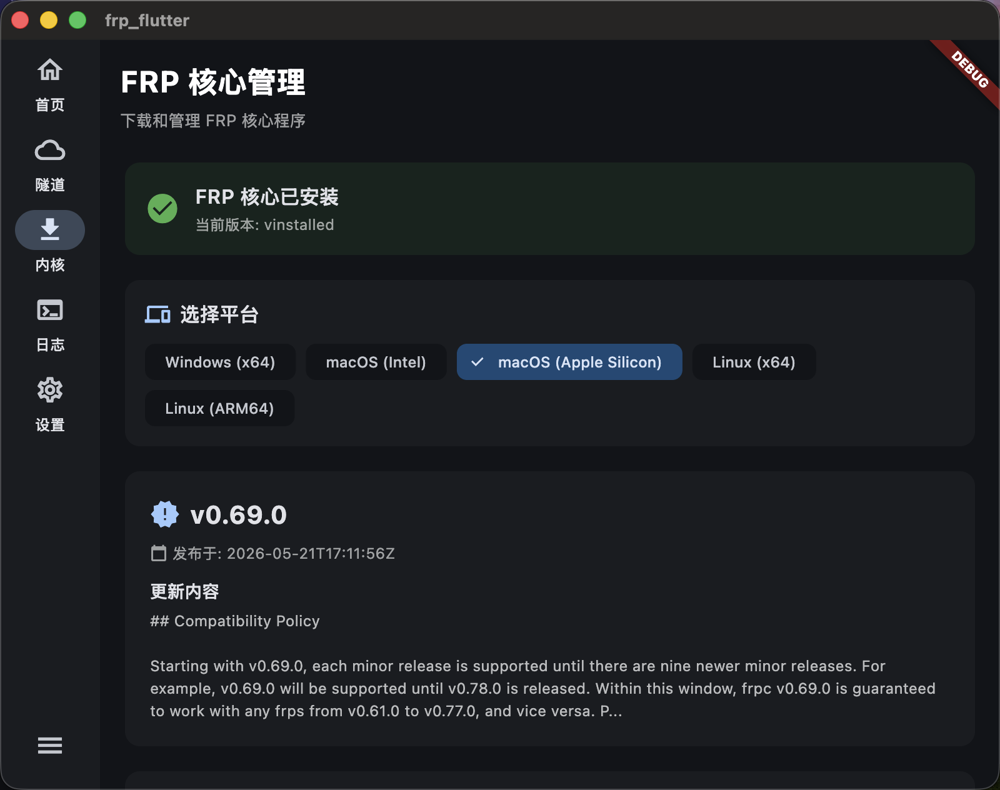
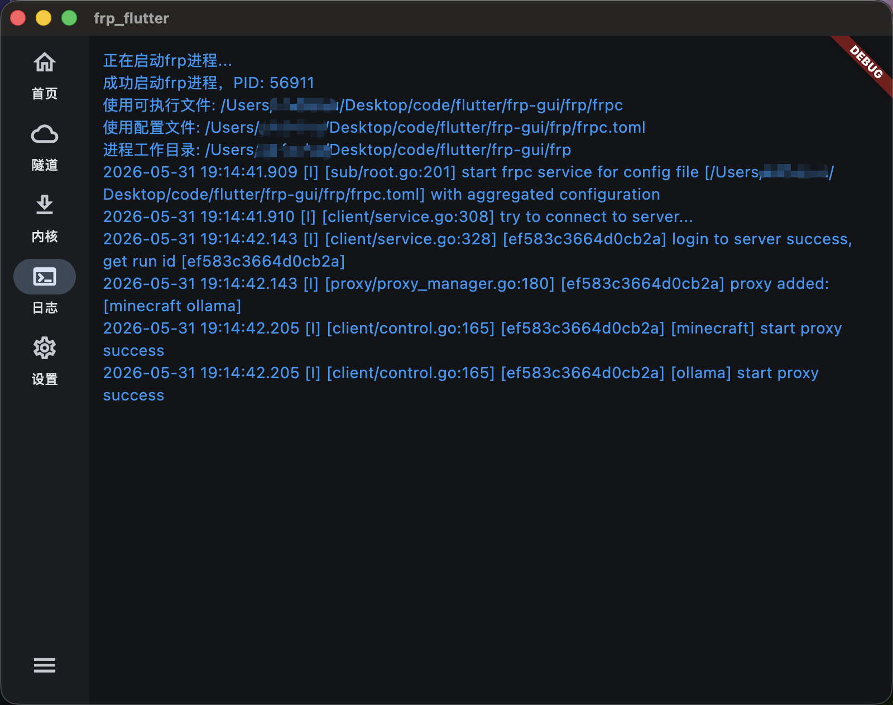

# frp-gui

A cross-platform FRP (Fast Reverse Proxy) GUI management client built with Flutter, supporting Windows / macOS / Linux / Android / iOS.

> [中文文档](./README_zh.md) | [Build Guide](./BUILD.md)

---

## Architecture

```
┌──────────────────────────────────────────────────────────┐
│                    UI Layer (Flutter)                     │
│  ┌────────┬────────┬──────────┬──────────┬───────────┐  │
│  │ OOBE   │  Home  │ Tunnels  │ Download │   Logs    │  │
│  │ Setup  │ Start/ │   CRUD   │   Auto   │ Real-time │  │
│  │ Wizard │ Stop   │  Config  │  Update  │  Output   │  │
│  ├────────┴────────┴──────────┴──────────┴───────────┤  │
│  │         Settings · Server / Theme / Autostart       │  │
│  ├─────────────────────────────────────────────────────┤  │
│  │       State Management (Provider + ValueNotifier)    │  │
│  ├─────────────────────────────────────────────────────┤  │
│  │  FrpService    DownloadManager   TunnelStorage      │  │
│  │  (Process)     (Chunked DL/Extract) (TOML Storage)  │  │
│  ├─────────────────────────────────────────────────────┤  │
│  │              FRP Binary (frpc)                       │  │
│  │        External subprocess, stdout captured           │  │
│  └─────────────────────────────────────────────────────┘  │
└──────────────────────────────────────────────────────────┘
```

---

## Screenshots

### macOS — Main Interface



### macOS — Core Download



### macOS — Log Viewer



---

## Features

| Module | Description |
|--------|-------------|
| 🚀 **OOBE Wizard** | First-launch setup wizard for FRP server address, remote port, and token |
| 🏠 **Home** | One-click start/stop FRP daemon with real-time status |
| 🔗 **Tunnels** | Visual CRUD for proxy configs (TOML), add/edit/delete/enable/disable tunnel rules |
| 📥 **Core Download** | Auto-fetch latest FRP binaries from GitHub Releases with multi-threaded chunked download + auto-extract |
| 📋 **Logs** | Real-time scrollable FRP process output, ANSI escape codes sanitized |
| 🎨 **Appearance** | Light/Dark/System theme + custom accent color (Material You) |
| ⚙️ **Server Config** | Configure FRP server address, port, and authentication token |
| 🔄 **Autostart** | Desktop platforms support auto-starting FRP on system boot |

### Highlights

- **Responsive Layout**: Sidebar navigation for screens > 600px, bottom nav bar for ≤ 600px
- **Platform Auto-Detection**: Detects system architecture (x64/ARM64) and downloads the matching FRP binary
- **macOS Sandbox Ready**: Auto-strips quarantine attribute & sets executable permission
- **i18n**: Chinese (default) + English
- **OOBE First-Run Wizard**: New users are guided through server configuration on first launch

---

## Supported Platforms

| Platform | Status | Package Format |
|----------|--------|----------------|
| Windows (x64) | ✅ Complete | `.exe` (MSIX optional) |
| macOS (Intel + Apple Silicon) | ✅ Complete | `.app` |
| Linux (x64 + ARM64) | ✅ Complete | Executable |
| Android | ✅ Complete | `.apk` / `.aab` |
| iOS | ✅ Complete | `.ipa` |
| Web | ⚠️ Minimal | Scaffold only |

---

## Deployment

### Download

Download the latest frp-gui from the GitHub Releases page:

| Platform | Format |
|----------|--------|
| Windows | `frp-gui-windows-x64.zip` |
| macOS (Intel) | `frp-gui-macos-x64.dmg` |
| macOS (Apple Silicon) | `frp-gui-macos-arm64.dmg` |
| Linux | `frp-gui-linux-x64.tar.gz` |
| Android | `frp-gui-android.apk` |

### Running the Client

Simply run the application on your platform:

- **Windows**: Extract and double-click `frp_gui.exe`
- **macOS**: Drag the `.app` into Applications, then open it
- **Linux**: Run `./frp_gui` in terminal

#### First-Time Setup (OOBE)

On first launch, the **OOBE Setup Wizard** will guide you through configuring the FRP server connection:

| Setting | Description | Example |
|---------|-------------|---------|
| Server Address | FRP server IP or domain | `192.168.1.100` or `frp.example.com` |
| Remote Port | FRP server bind port | `7000` |
| Token | Server authentication token (optional) | — |

After clicking "Complete Setup", the configuration is saved to `frp/frpc.toml` and you'll be taken to the main interface. Subsequent launches will skip the OOBE wizard.

> **Tip**: You can modify server settings anytime via **Settings → Server Configuration**.

#### Tunnel Management

In the Tunnels page you can:

- **Create**: Add new tunnels with name, type (tcp/udp/http), local IP/port, remote port
- **Edit**: Modify existing tunnel configurations
- **Toggle**: Enable/disable individual tunnels with a switch
- **Delete**: Remove unused tunnel configurations

Each tunnel is stored as an independent `.toml` file under `frp/tunnels/`. Enabled state is controlled by file extension (`.toml` / `.bak`).

#### Autostart

Desktop platforms (Windows/macOS/Linux) support auto-starting FRP on system boot:

1. Go to **Settings**
2. Toggle **Autostart** on
3. FRP will automatically start on next system boot

---

## Project Structure

```
frp-gui/
├── lib/
│   ├── main.dart                    # App entry, OOBE detection
│   ├── routes/
│   │   └── index.dart               # Routing & theme config
│   ├── pages/
│   │   ├── OOBE/                    # First-run setup wizard
│   │   ├── Main/                    # Main page (adaptive layout)
│   │   ├── Home/                    # Home (start/stop button)
│   │   ├── Tunnel/                  # Tunnel management
│   │   ├── Download/                # Core download page
│   │   ├── Log/                     # Log viewer
│   │   ├── Settings/                # Appearance · Server · Autostart
│   │   └── popupwindows/            # Dialog components
│   ├── components/                  # Sub-components per page
│   └── utils/
│       ├── FrpService.dart          # FRP process management (singleton)
│       ├── DownloadManager.dart     # Download manager (singleton)
│       ├── TunnelStorage.dart       # Tunnel & server config persistence
│       ├── ConfigStorage.dart       # Theme persistence
│       ├── AutoStartManager.dart    # Autostart management
│       └── TerminalUtil.dart        # Log output utility
├── frp/
│   ├── frpc                         # FRP client binary (auto-downloaded)
│   ├── frpc.toml                    # Main config file
│   └── tunnels/                     # Per-tunnel config directory
├── image/                           # Screenshots
├── android/                         # Android platform
├── ios/                             # iOS platform
├── macos/                           # macOS platform
├── linux/                           # Linux platform
├── windows/                         # Windows platform
└── web/                             # Web platform (minimal)
```

---

## Development

### Prerequisites

- **Flutter SDK** ≥ 3.10.7
- **Dart SDK** ≥ 3.10.7

Platform-specific build tools:

| Target | Required Tools |
|--------|----------------|
| Android | Android Studio + Android SDK |
| iOS / macOS | Xcode 15+ + CocoaPods |
| Windows | Visual Studio 2022 (with "Desktop development with C++") |
| Linux | CMake + GTK 3 dev libraries |

### Quick Start

```bash
# 1. Clone the repo
git clone <your-repo-url>
cd frp-gui

# 2. Install dependencies
flutter pub get

# 3. Run (auto-selects current platform)
flutter run
```

### Building for Release

See [BUILD.md](./BUILD.md) for detailed per-platform release build instructions.

### Dependencies

Key packages:

| Package | Purpose |
|---------|---------|
| `provider` | State management |
| `shared_preferences` | Local persistence (OOBE state, theme) |
| `toml` | TOML config parsing |
| `window_manager` | Desktop window control |
| `xterm` | Terminal emulation (logs) |
| `dynamic_color` | Material You dynamic colors |
| `archive` | Archive extraction for downloads |

---

## Notes

1. **FRP binary must be downloaded separately**: Use the Core Download page in-app to fetch the matching `frpc` from GitHub Releases
2. **macOS first launch**: Sandbox is disabled; you may need to manually allow network access on first run
3. **Linux prerequisites**:
   ```bash
   sudo apt install libgtk-3-dev cmake clang
   ```
4. **Windows**: Requires Visual Studio 2022 with "Desktop development with C++" workload

---

## License

This project uses FRP binaries from [fatedier/frp](https://github.com/fatedier/frp), distributed under the Apache 2.0 License.

